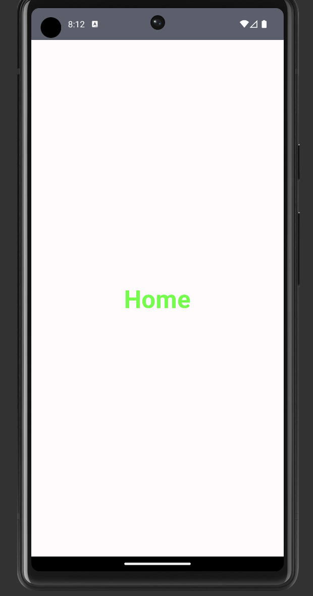

--this is a guide to create a simple navigation between two screens


<div align="center">
  
  
</div>


### Navigation:

- to navigate between different screens or destinations within an app.

## Steps:

1. Add the following dependency in gradle:
-

  ```
  dependencies {
   def nav_version = "2.6.0"
  
   implementation "androidx.navigation:navigation-compose:$nav_version"
  }
  ```

1. create screen composables to navigate between
2. create a sealed class for defining objects with unique routes that corresponds  to each screen.
3. create NavController
4. create a NavHost→
5. then add logic to navigate from one screen to another, e.g. you can add a button clicking on which takes u to another screen. use NavController.navigate for this
6. also add logic to navigate back
7. navigate back explicitly and popBackStack using:

   popUpTo function.


### Sealed class to hold screen routes:

-

```
sealed class Screen(val route: String){
    object Home: Screen(route = "home_screen")
    object Detail: Screen(route = "detail_screen")
}

```

### NavController:

- the central API for the Navigation component
- keeps track of the back stack of composables that make up the screens in your app and the state of each screen.
- You can create a`NavController`by using the`[rememberNavController() method in your composable:
- `val navController = rememberNavController()`

### **Creating a NavHost:**

- Each`NavController`must be associated with a single NavHost composable
- The`NavHost`links the`NavController`to the composable destinations that you should be able to navigate between.
- Creating the`NavHost`requires the`NavController`previously created via`rememberNavController()`and the route of the starting destination of your graph.
- You can add to your navigation structure by using themethod. 
- This method requires that you provide a route and the composable that should be linked to the destination: