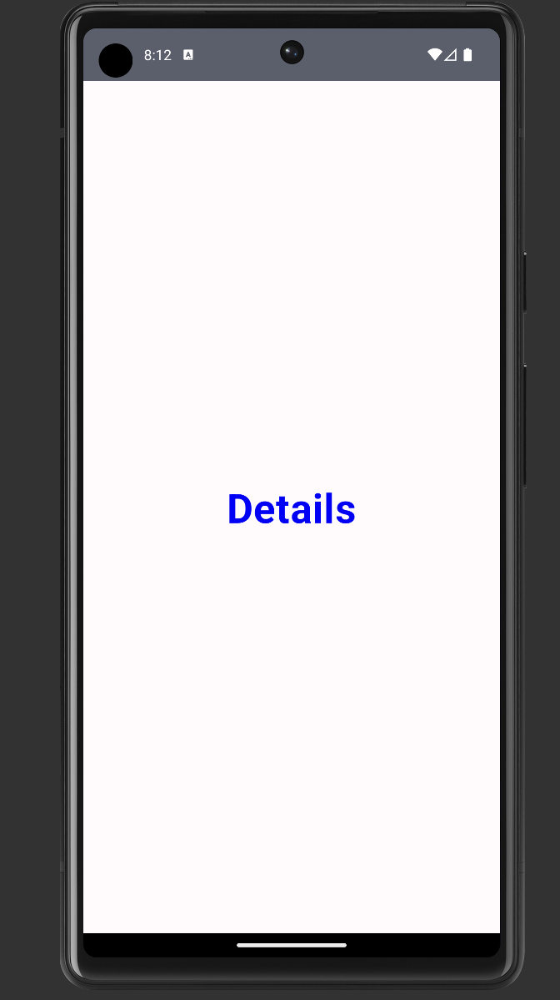

--this is a guide to create a simple navigation between two screens

  
  

--steps:
1. add the latest dependency in Gradle Scripts for navigation from official docs
   //for navigation
   def nav_version = "2.6.0"
   implementation "androidx.navigation:navigation-compose:$nav_version"

2. 